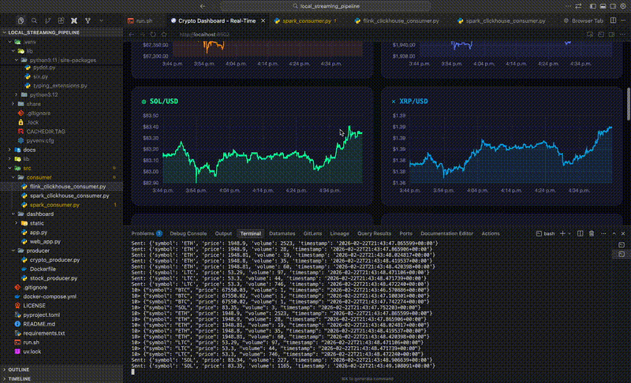

# Local Streaming Pipeline

<p align="center">
  
</p>

> A local streaming pipeline for learning real-time data processing with Kafka, Spark/Flink, and ClickHouse.


```text
Producer --> Kafka --> Spark/Flink --> ClickHouse --> Dashboard
```

## Quick Start

```bash
# 1. Start infrastructure
docker-compose up -d

# 2. Install dependencies
uv venv && source .venv/bin/activate
uv pip install -r requirements.txt

# 3. Create Kafka topic
docker exec kafka /opt/kafka/bin/kafka-topics.sh \
  --bootstrap-server localhost:9092 \
  --create --topic stock-ticks --partitions 1 --replication-factor 1

# 4. Run the pipeline (pick one option below)
./run.sh
```

## Run Options

The pipeline supports 4 configurations combining **processing engine** and **data source**:

| Option | Data Source | Processing | Command |
|--------|-------------|------------|---------|
| **Spark + Stocks** | Synthetic stock prices | Micro-batch (3s) | `./run.sh spark web` |
| **Spark Streaming + Stocks** | Synthetic stock prices | Windowed aggs + checkpoints | `./run.sh spark streaming web` |
| **Spark + Crypto** | Real-time Coinbase | Micro-batch (3s) | `./run.sh spark web --crypto` |
| **Spark Streaming + Crypto** | Real-time Coinbase | Windowed aggs + checkpoints | `./run.sh spark streaming web --crypto` |
| **Flink + Stocks** | Synthetic stock prices | True streaming | `./run.sh flink web` |
| **Flink + Crypto** | Real-time Coinbase | True streaming | `./run.sh flink web --crypto` |

### Data Sources

| Source | Description | Symbols |
|--------|-------------|---------|
| **Synthetic (Stocks)** | Randomly generated stock prices with volatile movements | AAPL, GOOGL, MSFT, AMZN, META |
| **Real-time (Crypto)** | Live prices from Coinbase WebSocket (no API key needed) | BTC, ETH, SOL, XRP, DOGE, LTC |

### Processing Engines

| Engine | Model | Latency | Best For |
|--------|-------|---------|----------|
| **Spark** | Micro-batch (every 3 seconds) | Seconds | Batch + streaming, ML pipelines |
| **Spark Streaming** | Windowed aggregations + checkpoints | Seconds | Event-time processing, VWAP |
| **Flink** | True streaming (per record) | Milliseconds | Real-time dashboards, alerts |

### Dashboard Options

| Dashboard | Port | Command |
|-----------|------|---------|
| **Web (FastAPI)** | 8502 | `./run.sh [spark\|flink] web` |
| **Streamlit** | 8501 | `./run.sh [spark\|flink] streamlit` |

### Examples

```bash
# Default: Spark + Synthetic + Streamlit
./run.sh

# Spark Streaming with windowed aggregations + Web dashboard
./run.sh spark streaming web

# Flink with real crypto data and web dashboard
./run.sh flink web --crypto

# Spark with real crypto data
./run.sh spark web --crypto

# Just Flink + Synthetic + Streamlit
./run.sh flink
```

## Architecture

```text
+-------------------+       +-----------+       +-------------------+       +-------------+       +-------------+
|                   |       |           |       |                   |       |             |       |             |
| stock_producer_demo  | ----> |   Kafka   | ----> | Spark/Flink       | ----> | ClickHouse  | ----> | Dashboard   |
| (synthetic demo)     |       |           |       | Consumer          |       |             |       | (FastAPI)   |
|        OR            |       |           |       |                   |       |             |       |             |
| crypto_producer      |       |           |       | spark_microbatch  |       |             |       |             |
| (Coinbase)           |       |           |       | spark_streaming   |       |             |       |             |
|                      |       |           |       | flink_clickhouse  |       |             |       |             |
+-------------------+       +-----------+       +-------------------+       +-------------+       +-------------+
```

## Prerequisites

- Docker
- Python 3.10+
- Java 11 (for Flink)
- [uv](https://github.com/astral-sh/uv) (Python package manager)

## Setup

### 1. Start Infrastructure

```bash
docker-compose up -d
```

Verify all containers are running:

```bash
docker ps
```

You should see:

```text
NAMES        IMAGE                              STATUS
kafka        apache/kafka:3.7.0                 Up
clickhouse   clickhouse/clickhouse-server:24.1  Up
```

### 2. Create Python Virtual Environment

```bash
uv venv
source .venv/bin/activate
```

### 3. Install Python Dependencies

```bash
uv pip install -r requirements.txt
```

### 4. Create Kafka Topic

```bash
docker exec kafka /opt/kafka/bin/kafka-topics.sh \
  --bootstrap-server localhost:9092 \
  --create \
  --topic stock-ticks \
  --partitions 1 \
  --replication-factor 1
```

### 5. Create ClickHouse Database and Table

```bash
docker exec -it clickhouse clickhouse-client
```

```sql
CREATE DATABASE IF NOT EXISTS stocks;

CREATE TABLE IF NOT EXISTS stocks.ticks (
    symbol String,
    price Float64,
    volume UInt32,
    timestamp DateTime64(6)
) ENGINE = MergeTree()
ORDER BY (symbol, timestamp);
```

## Running the Pipeline

### Option 1: Using run.sh (Recommended)

The `run.sh` script starts all components automatically:

```bash
# Flink + Real Crypto + Web Dashboard (recommended for real-time)
./run.sh flink web --crypto

# Spark + Synthetic Stocks + Web Dashboard
./run.sh spark web
```

Press `Ctrl+C` to stop all services.

### Option 2: Manual (Separate Terminals)

**Terminal 1 - Producer:**

```bash
# Synthetic stocks (demo)
python src/demo/stock_producer_demo.py

# OR Real crypto (production)
python src/production/producer/crypto_producer.py
```

**Terminal 2 - Consumer:**

```bash
# Flink (true streaming)
python src/production/consumer/flink_clickhouse_consumer.py

# OR Spark (micro-batch)
python src/production/consumer/spark_microbatch_clickhouse_consumer.py

# OR Spark (streaming with windowed aggregations)
python src/production/consumer/spark_streaming_clickhouse_consumer.py
```

**Terminal 3 - Dashboard:**

```bash
# Web dashboard
python src/production/dashboard/web_app.py

# OR Streamlit
streamlit run src/production/dashboard/app.py
```

**Terminal 4 - Query ClickHouse (optional):**

```bash
docker exec -it clickhouse clickhouse-client
```

```sql
SELECT * FROM stocks.ticks ORDER BY timestamp DESC LIMIT 10;
```

### Dashboard URLs

| Dashboard | URL |
|-----------|-----|
| Web (FastAPI) | <http://localhost:8502> |
| Streamlit | <http://localhost:8501> |

## Project Structure

```text
local_streaming_pipeline/
├── docker-compose.yml       # Kafka + ClickHouse setup
├── requirements.txt         # Python dependencies
├── run.sh                   # Pipeline runner script
├── lib/                     # Flink connector JARs
├── src/
│   ├── demo/
│   │   ├── spark_consumer_demo.py     # Spark -> Console (learning/demo)
│   │   └── stock_producer_demo.py     # Synthetic stock data (demo)
│   └── production/
│       ├── consumer/
│       │   ├── flink_clickhouse_consumer.py             # Flink -> ClickHouse
│       │   ├── spark_microbatch_clickhouse_consumer.py  # Spark micro-batch -> ClickHouse
│       │   └── spark_streaming_clickhouse_consumer.py   # Spark streaming (windowed aggs) -> ClickHouse
│       ├── producer/
│       │   ├── Dockerfile             # Producer container config
│       │   └── crypto_producer.py     # Real-time Coinbase crypto
│       └── dashboard/
│           ├── app.py               # Streamlit dashboard
│           ├── web_app.py           # FastAPI web dashboard
│           └── static/
│               ├── stock_index.html   # Stock dashboard UI
│               └── crypto_index.html  # Crypto dashboard UI
├── docs/
│   ├── KAFKA_README.md      # Kafka concepts & commands
│   ├── PYSPARK_README.md    # PySpark streaming guide
│   ├── FLINK_README.md      # Flink streaming guide
│   └── CLICKHOUSE_README.md # ClickHouse analytics guide
└── README.md                # This file
```

## Documentation

| Topic | Description |
| ----- | ----------- |
| [Kafka](docs/KAFKA_README.md) | Message broker concepts, topics, partitions, commands |
| [PySpark](docs/PYSPARK_README.md) | Structured Streaming, micro-batching, Kafka integration |
| [Spark Streaming](docs/SPARK_STREAMING_README.md) | Watermarks, windowed aggregations, checkpointing, VWAP |
| [Flink](docs/FLINK_README.md) | True streaming, PyFlink, Kafka & ClickHouse integration |
| [ClickHouse](docs/CLICKHOUSE_README.md) | Column storage, MergeTree engine, SQL queries |

## Troubleshooting

### Kafka not running

```bash
docker-compose up -d kafka
docker logs kafka
```

### ClickHouse table not found

Create the database and table (see Setup step 5).

### Flink: Java not found

Install Java 11:

```bash
# macOS
brew install openjdk@11
export JAVA_HOME=$(/usr/libexec/java_home -v 11)
```

### Port already in use

Check what's using the port:

```bash
lsof -i :8502  # Web dashboard
lsof -i :8501  # Streamlit
lsof -i :9092  # Kafka
```
